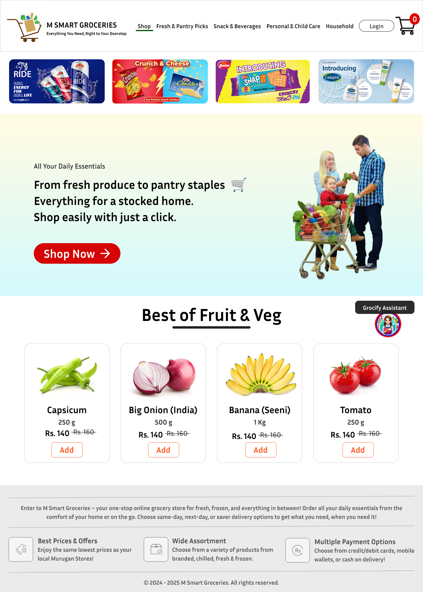
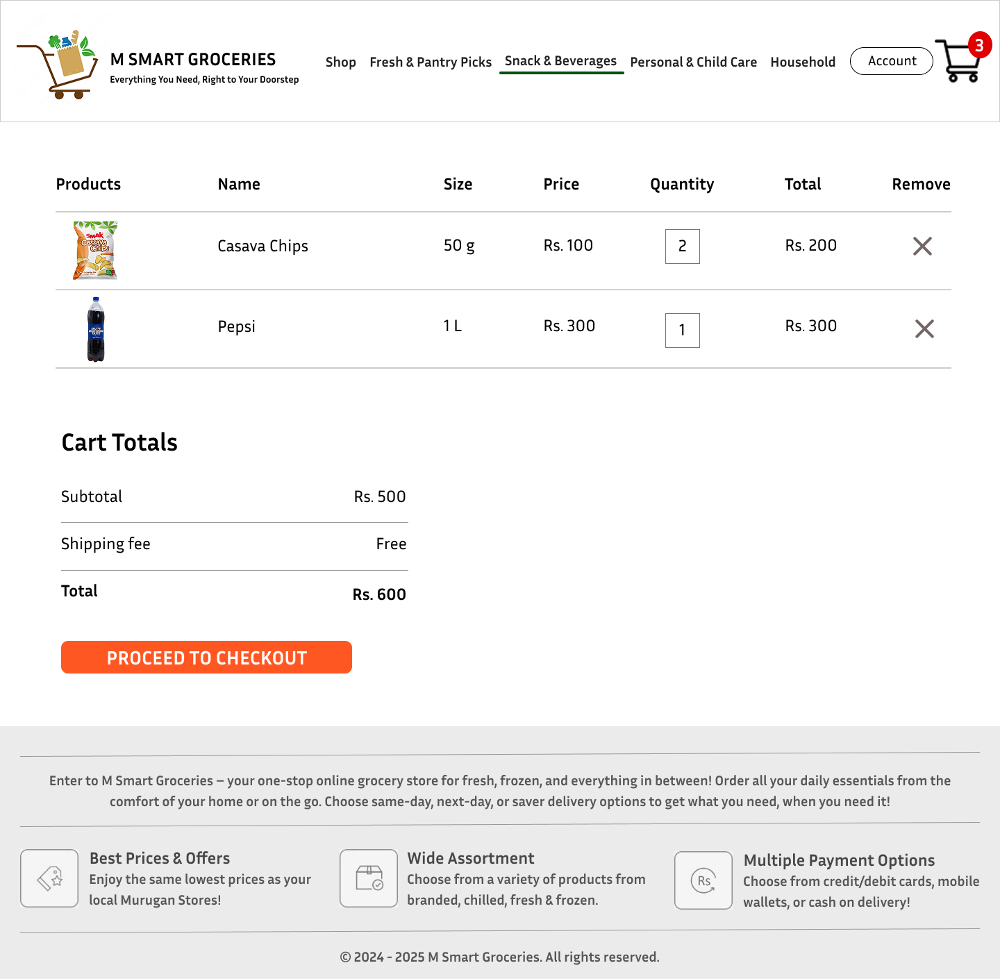
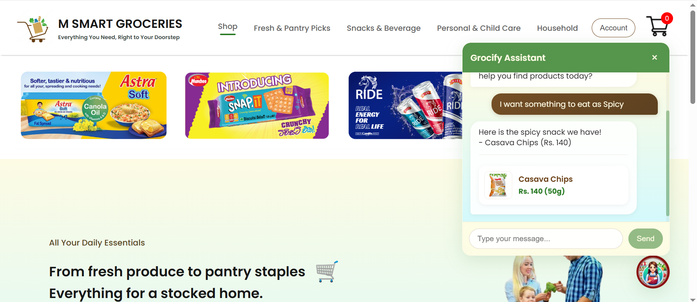
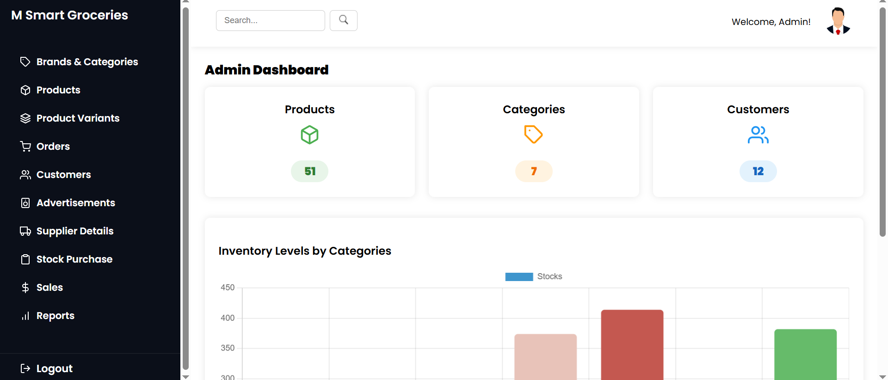
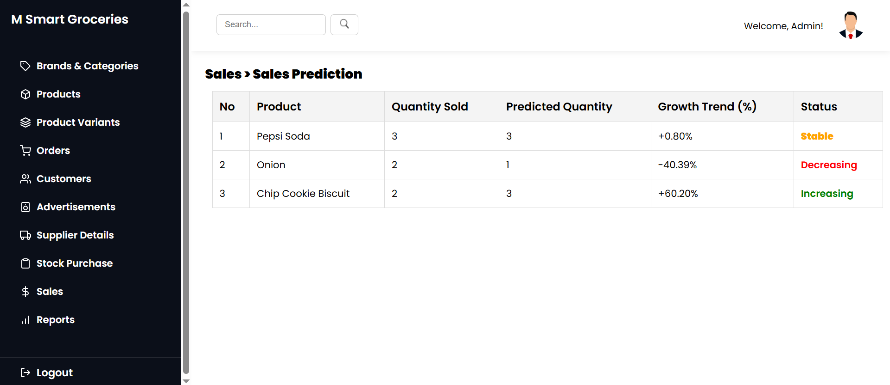

# 🛒 M Smart Groceries – AI-Powered Grocery E-Commerce Platform

**M Smart Groceries** is a next-generation AI-powered grocery e-commerce web application built with the **MERN stack**. This project addresses key limitations in Sri Lanka’s current online grocery landscape by combining smart automation, personalized recommendations, and a user-friendly design to enhance the digital shopping experience.

---

## 📸 Screenshots

### 🛍️ Homepage (React Frontend)

---

### 🛒 Product View & Add to Cart

---

### 🧠 AI Chatbot Integration (Dialogflow)

---

### 📈 Admin Dashboard – Orders & Sales

---

### 🤖 AI Sales Prediction Visualization

---

## 📌 Key Features

- 🔐 **Role-Based Login** for customers and admins
- 📦 **Inventory Management** with real-time updates
- 🧠 **AI Sales Prediction** using historical data (TensorFlow.js)
- 💬 **AI Chatbot** (Dialogflow) for real-time support & suggestions
- 🛒 **Cart and Checkout** system with order history
- 📊 **Admin Dashboard** with analytics & order tracking
- 🧾 **Invoice Generation**
- 💳 **Multi-payment Support** – COD, card payment integration (planned)

---

## 💻 Tech Stack

| Layer            | Technologies Used                         |
|------------------|-------------------------------------------|
| Frontend         | React.js, Bootstrap, SweetAlert2          |
| Backend          | Node.js, Express.js                       |
| Database         | MongoDB (NoSQL)                           |
| AI Prediction    | TensorFlow.js                             |
| AI Chatbot       | Dialogflow + Firebase integration         |
| State Management | Context API (React)                       |
| PDF Generator    | jsPDF (optional for invoices)             |

---

## 🧠 AI-Powered Features

### 🔮 Sales Prediction Engine
- Uses TensorFlow.js to forecast product demand
- Helps prevent stockouts and overstocking
- Improves supply chain efficiency

### 🤖 AI Chatbot (Dialogflow)
- Understands natural language queries
- Assists in product discovery, order tracking, and FAQ
- Improves user engagement and conversion rate

---

## 🧪 Testing Strategy

- ✅ Unit testing for APIs and frontend logic
- ✅ Manual testing across devices
- ✅ Tested for network failures, payment flow, and input validation

---

## 📊 Research & Development

- 📋 User research via Google Forms to understand local pain points
- 🔁 Agile Scrum development with weekly sprint reviews
- 🔍 Continuous improvements based on user feedback

---

## 🌍 Vision

M Smart Groceries is not just a project — it's a **tech-driven solution** to bridge the gap between traditional retail and digital convenience in Sri Lanka. By focusing on **AI-driven decision making, usability, and accessibility**, this platform aims to transform how essential goods are delivered.

---

## 🙋‍♂️ Author

**Nithurshan Nadesan**  
BEng(Hons) in Software Engineering  
[LinkedIn](https://www.linkedin.com/in/nithurshan-nadesan/)

---

## 🏷️ Tags

#mernstack #ecommerce #aiproject #reactjs #nodejs #mongodb #dialogflow #tensorflowjs #groceryapp #studentproject #srilanka #projectshowcase

